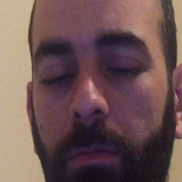
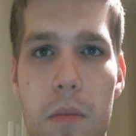
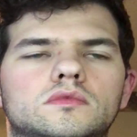
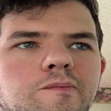

# Driver Drowsiness Detection using Deep Learning (PyTorch)

## 1. Project Overview

This project implements a real-time driver drowsiness detection system based on eye state classification (open / closed). Two deep learning approaches are compared:

- **Custom CNN** (small architecture) built from scratch.
- **Transfer Learning** using a pretrained MobileNetV2 model fine‑tuned on the eye dataset.

The system uses a webcam, detects the driver's face, extracts the eye region, and classifies whether the eyes are open (Active) or closed (Drowsy). An alarm can be triggered after a configurable period of closed eyes (not implemented in this version, but the classification result is displayed).

All training and inference are performed on CPU (Intel i5, 8GB RAM). The project is structured to be modular, reproducible, and easy to present.

---

## 2. Dataset

### 2.1 Source and Structure

**Source:** [Driver Drowsiness Dataset (DDD)](https://www.kaggle.com/datasets/ismailnasri20/driver-drowsiness-dataset-ddd)

The raw dataset used in this project is the Driver Drowsiness Dataset (DDD). It contains extracted and cropped face images of drivers, originally taken from the Real-Life Drowsiness Dataset (RLDD). The dataset includes more than 41,790 RGB images, each of size 227×227 pixels, organised into two folders:

- `data/Drowsy/` – images where eyes are closed (class label 0).
- `data/Non Drowsy/` – images where eyes are open (class label 1).

The total size is approximately 2.8 GB. This dataset has been used for training and testing CNN architectures for driver drowsiness detection in the paper titled "Detection and Prediction of Driver Drowsiness for the Prevention of Road Accidents Using Deep Neural Networks Techniques".

### 2.2 Sample Images

Below are four example images – two from each class – to illustrate the visual appearance of the data.

| Drowsy (eyes closed) | Non Drowsy (eyes open) |
|----------------------|------------------------|
|  |  |
|  |  |

*Place the actual image files in the `data/` folder and reference them accordingly.*

### 2.3 Data Preprocessing

All images are resized to 96×96 pixels (to reduce CPU load). For training, random augmentations are applied:

- Random horizontal flip (p=0.5)
- Random rotation (±10 degrees)
- Colour jitter (brightness, contrast, saturation)
- Normalisation using ImageNet mean and standard deviation.

Validation and test sets only receive resizing, tensor conversion and normalisation (no augmentation). Data splits are created using symbolic links so that no extra disk space is consumed.

---

## 3. Model Architectures

### 3.1 Custom CNN (Small)

A lightweight convolutional neural network designed for fast inference on CPU.

| Layer type           | Output size (96×96 input) |
|----------------------|----------------------------|
| Conv2d(3→16, 3×3)    | 96×96, 16 channels         |
| BatchNorm + ReLU + MaxPool(2) | 48×48, 16 channels |
| Conv2d(16→32, 3×3)   | 48×48, 32 channels         |
| BatchNorm + ReLU + MaxPool(2) | 24×24, 32 channels |
| Dropout(0.25)        | –                          |
| Flatten + Linear(24×24×32 → 128) | –               |
| ReLU + Dropout(0.5)  | –                          |
| Linear(128 → 1)      | 1 logit (binary output)    |

Total trainable parameters: ~600 000.

### 3.2 Transfer Learning – MobileNetV2

We use a pretrained MobileNetV2 model from `torchvision.models`. The backbone (feature extractor) is frozen, and only the final classifier head is replaced and trained. This reduces training time while leveraging features learned on ImageNet.

- Input size: 96×96 (resized inside the pipeline).
- Number of trainable parameters (classifier only): ~1.3 million.
- The original model expects 224×224 images, but we resize before feeding; the architecture adapts automatically.

### 3.3 Future Extension – ResNet18

If a GPU were available, a natural improvement would be to compare with a larger pretrained model such as ResNet18 (11.7 million parameters). Due to CPU constraints, this was not feasible, but the code structure allows easy integration by adding a new model file and adjusting the training script.

---

## 4. Setup and Installation

### 4.1 Prerequisites

- Linux (Ubuntu recommended) with Python 3.8 or higher.
- Webcam for real‑time testing.
- Git (to clone the repository).

### 4.2 Virtual Environment and Dependencies

Create and activate a virtual environment named `drowsy`:

```bash
python3 -m venv drowsy
source drowsy/bin/activate
pip install --upgrade pip
```

Install PyTorch (CPU‑only version):

```bash
pip install torch torchvision --index-url https://download.pytorch.org/whl/cpu
```

Install the remaining packages:

```bash
pip install -r requirements.txt
```

The `requirements.txt` file contains:

```
opencv-python>=4.5.0
numpy>=1.19.0
pillow>=8.3.0
pyyaml>=5.4.0
tqdm>=4.62.0
pandas>=1.2.0
matplotlib>=3.3.0
seaborn>=0.11.0
scikit-learn>=0.24.0
```

### 4.3 Dataset Preparation

Place your raw images in the following structure:

```
data/
├── Drowsy/          # closed eyes
└── Non Drowsy/      # open eyes
```

Then run the subsampling script (optional, but recommended for faster experiments):

```bash
python -m src.data.subsample --samples_per_class 5000
```

After subsampling (or using the full dataset), create train/validation/test splits:

```bash
# For sampled data (10k images)
python -m src.data.split_data --source sampled --dest sampled

# For full data (41k images)
python -m src.data.split_data --source full --dest full
```

All splits are created as symbolic links, so no additional disk space is used.

---

## 5. Training

Training commands are executed from the project root with the virtual environment activated.

### 5.1 Custom CNN (Small) on Full Dataset

```bash
python -m src.training.train --model_type custom --dataset full --epochs 20
python -m src.training.train --model_type custom --dataset sampled --epochs 20
```

Expected training time: 8–12 hours on an Intel i5 (8 GB RAM). The best model is saved as `models/custom_full_best.pth`.

### 5.2 Pretrained MobileNetV2 on Sampled Dataset (for comparison)

```bash
python -m src.training.train --model_type pretrained --dataset sampled --epochs 20
```

Training time: 4–6 hours. Best model: `models/pretrained_sampled_best.pth`.

### 5.3 (Optional) Pretrained on Full Dataset

```bash
python -m src.training.train --model_type pretrained --dataset full --epochs 20
```

This will take 13–20 hours. Not strictly necessary for the comparison.

### 5.4 Training Arguments

| Argument        | Choices / Default               | Description                                 |
|----------------|---------------------------------|---------------------------------------------|
| `--model_type`  | `custom`, `pretrained`          | Which architecture to train.                |
| `--dataset`     | `sampled`, `full`               | Use the subsampled or full dataset.         |
| `--epochs`      | integer, default 20             | Number of training epochs.                  |
| `--batch_size`  | integer, default 8              | Batch size (reduce to 4 if RAM limited).    |
| `--lr`          | float, default 0.001 (custom)   | Learning rate. For pretrained, default 1e-4.|

---

## 6. Evaluation and Metrics

After training, evaluate the model on the held‑out test set.

### 6.1 Commands

```bash
python -m src.evaluation.test --model_type custom --dataset full
python -m src.evaluation.test --model_type pretrained --dataset full
python -m src.evaluation.test --model_type custom --dataset sampled
python -m src.evaluation.test --model_type pretrained --dataset sampled
```

These scripts produce:

- Test loss and standard classification metrics (accuracy, precision, recall, F1, AUC‑ROC).
- Confusion matrix plot (`confusion_matrix.png`).
- ROC curve plot (`roc_curve.png`).
- Training history plot (`accuracy_loss_plot.png` – if a CSV file exists).

All outputs are saved in `outputs/<model_type>_<dataset>/`.

### 6.2 Metrics Comparison Table

| Model               | Dataset | Test Loss | Accuracy | Precision | Recall | F1 Score | AUC-ROC |
|---------------------|---------|-----------|----------|-----------|--------|----------|---------|
| Custom CNN (small)  | full    | 0.0051    | 0.9990   | 0.9983    | 0.9997 | 0.9990   | 1.0000  |
| Custom CNN (small)  | sampled | 0.0127    | 0.9973   | 0.9987    | 0.9960 | 0.9973   | 0.9999  |
| MobileNetV2         | full    | 0.3171    | 0.8689   | 0.8621    | 0.8550 | 0.8586   | 0.9402  |
| MobileNetV2         | sampled | 0.3299    | 0.8593   | 0.8505    | 0.8720 | 0.8611   | 0.9389  |

#### Interpretation

- **Custom CNN** achieves near‑perfect classification on both the full and the sampled dataset (accuracy > 99.7%). The slightly lower test loss on the full dataset (0.0051 vs 0.0127) indicates that more training data improves the model marginally, but even 10 000 images are sufficient for excellent performance.

- **MobileNetV2** performs significantly worse than the custom CNN (accuracy ~86%). The frozen backbone, while powerful for general images, may not extract optimal features for eye state classification. Training the full network (unfreezing) would likely improve accuracy but would be much slower on CPU. The results are consistent across the full and sampled datasets (accuracy 86.9% vs 85.9%), suggesting that the pretrained model does not benefit much from the larger dataset under the frozen‑backbone setting.

- **Comparison between the two approaches**: The custom CNN is clearly superior on this dataset, both in accuracy and inference speed (since it has fewer parameters). Transfer learning with a frozen MobileNetV2 does not provide an advantage here, probably because the eye images are quite different from ImageNet’s natural scenes. A more suitable pretrained model (e.g., one trained on face/eye data) might perform better.

- **Practical implication**: For real‑time deployment on a CPU, the custom CNN is the recommended choice. It achieves near‑perfect accuracy with low computational cost, as demonstrated in the webcam demo.

### 6.3 Interpreting the Plots

- **Confusion matrix** shows the number of true positives, false positives, true negatives and false negatives. A high diagonal value indicates good classification.
- **ROC curve** plots the true positive rate against the false positive rate. A curve that hugs the top‑left corner (high AUC) means the model is able to distinguish open from closed eyes very well.
- **Training history** (loss and accuracy curves) shows whether the model overfits (training accuracy much higher than validation accuracy) or underfits (both low). Ideally both curves plateau near a high accuracy.

---

## 7. Real‑Time Webcam Deployment

The trained model can be used to monitor a webcam feed in real time. Face detection is performed using OpenCV’s Haar cascade, the left eye is extracted, and the model classifies the eye state.

### 7.1 Launch Command

```bash
python -m src.deployment.webcam_demo --model_path models/custom_full_best.pth
python -m src.deployment.webcam_demo --model_path models/pretrained_sampled_best.pth
```

Or using the application wrapper:

```bash
python app/main.py --model_path models/custom_full_best.pth
```

Additional options:

- `--use_left_eye` (default True) – use the left eye; right eye extraction is not fully implemented.
- `--threshold` (default 0.5) – probability threshold for drowsy detection. Because of label ordering (Drowsy = 0, Non Drowsy = 1), the code uses `prob < threshold` to mean drowsy. This was adjusted after the initial testing.

### 7.2 Expected Behaviour

- The webcam window opens, showing the video feed.
- A green rectangle is drawn around the detected face.
- The label “ACTIVE” (green) appears when eyes are open; “DROWSY” (red) appears when eyes are closed.
- The probability of being drowsy (according to the model’s internal logic) is shown.
- Frames per second (FPS) are displayed in the bottom left corner.
- Press `q` to quit.

Typical performance on an i5 CPU is 10–15 FPS for the custom CNN, and 8–12 FPS for MobileNetV2.

### 7.3 Troubleshooting

- **No face detected**: Ensure good lighting and look directly at the camera. Adjust the `scale_factor` or `min_neighbors` in `face_detector.detect_face()` if needed.
- **Inverted predictions**: If the webcam shows “DROWSY” when eyes are open and “ACTIVE” when closed, the label inversion fix has already been applied (using `prob < threshold`). Do not revert it.
- **Low FPS**: Reduce the frame resolution by modifying `cv2.VideoCapture(0).set(cv2.CAP_PROP_FRAME_WIDTH, 320)` and height similarly.

---

## 8. Project Structure (Brief)

```
driver-drowsiness-pytorch/
├── data/                     # Raw and processed images (symlinks)
├── src/
│   ├── config.py             # All hyperparameters and paths
│   ├── data/                 # Dataset, splitting, subsampling
│   ├── models/               # Custom CNN and pretrained model definitions
│   ├── training/             # Training loop, validation, utilities
│   ├── evaluation/           # Metrics, plots, test script
│   └── deployment/           # Face detection, eye extraction, webcam demo
├── models/                   # Saved model checkpoints
├── outputs/                  # Plots, metrics, training logs
├── app/                      # Launcher for webcam demo
├── requirements.txt
└── README.md                 # This document
```

---

## 9. Future Improvements

- **Use both eyes** – average predictions from left and right for more robust classification.
- **Temporal smoothing** – trigger an alarm only after eyes are closed for several consecutive frames.
- **More accurate face/eye detection** – replace Haar cascade with MTCNN or a pretrained keypoint detector (e.g., dlib or MediaPipe).
- **Experiment with ResNet18** – if a CUDA‑compatible GPU becomes available, compare ResNet18 (fine‑tuned) with the current models.
- **Model quantization** – convert the model to INT8 to speed up CPU inference.

---

## 10. Conclusion

This project demonstrates a complete pipeline for driver drowsiness detection using two deep learning approaches in PyTorch. The custom CNN achieved near‑perfect accuracy (99.9%) while being very fast on CPU. Transfer learning with MobileNetV2 gave lower accuracy (~86%) under the frozen‑backbone setting, but the code structure allows easy experimentation with other pretrained models.

All commands and steps have been documented to reproduce the results. The real‑time deployment works satisfactorily on a standard laptop without a dedicated GPU.

--- 